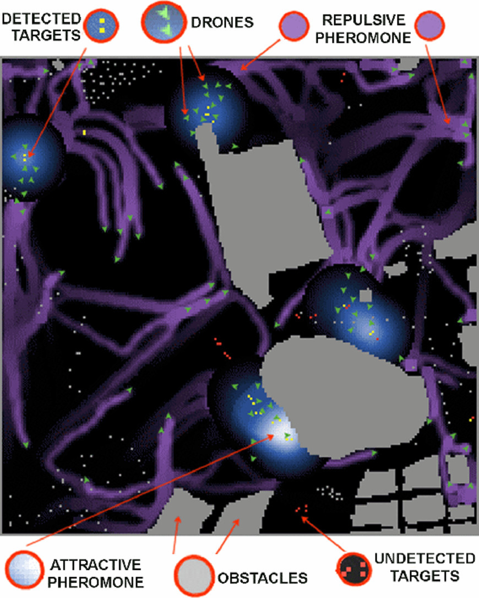

# Using Artificial Immune System to Prioritize Swarm Strategies for Environmental Monitoring



This repository provides the source code, configuration files, and supporting materials for the paper:

📄 **Using Artificial Immune System to Prioritize Swarm Strategies for Environmental Monitoring**  
**M. Monaco, G. Simionato, M. G. C. A. Cimino, G. Vaglini, S. Senatore, G. Caricato**  
Presented at: *2022 IEEE Conference on Cognitive and Computational Aspects of Situation Management (CogSIMA)*  
[DOI: 10.1109/CogSIMA54611.2022.9830665](https://doi.org/10.1109/CogSIMA54611.2022.9830665)

---

## 🧠 Overview

This project explores the use of an **Artificial Immune System (AIS)** to dynamically prioritize swarm behaviors for **environmental monitoring** using drones.  
It combines adaptive strategy selection with swarm intelligence principles such as **stigmergy**, **flocking**, and **differential evolution**, enabling a resilient response to real-world challenges like **wildfire detection and tracking**.

---

## 📁 Repository Structure

```
.
├── optimizer/         	# Implementation for swarm adaptation via Differential Evolution
├── scenarios/         	# Coding and configuration of application scenarios
├── src/        		# Core implementation of NetLogo model (AIS, swarm behaviors)
├── sciadro.nlogo	# Main file of NetLogo model
├── sfe-ais.jpg   	# Representative image
├── README.md
├── CITATION.cff
├── LICENSE
└── requirements.txt
```

---

## ⚙️ Installation

### Requirements

- NetLogo 6.1.1 or higher
- Python 3.8 or higher
- Install required packages:
```bash
pip install -r requirements.txt
```

---

## 🚀 How to Run

To run an optimization experiment using a predefined configuration:
```bash
python optimizer/de_with_nl4py.py
```

For detailed configuration setup:
- Open the `de_with_nl4py.py` file in the `optimizer/` folder

---

## 📊 Keywords

`environmental monitoring`, `drones swarm`, `stigmergy`, `flocking`, `differential evolution`, `artificial immune system`, `adaptive systems`

---

## 📜 License

This project is licensed under the **GNU General Public License v3.0 (GPLv3)**.  
See the [`LICENSE`](./LICENSE) file for more details.

---

## ✏️ Citation

If you use this code in your work, please cite the following paper:

```bibtex
@inproceedings{Monaco2022AISwarm,
  title={Using Artificial Immune System to Prioritize Swarm Strategies for Environmental Monitoring},
  author={Monaco, M. and Simionato, G. and Cimino, M. G. C. A. and Vaglini, G. and Senatore, S. and Caricato, G.},
  booktitle={2022 IEEE Conference on Cognitive and Computational Aspects of Situation Management (CogSIMA)},
  pages={104--110},
  year={2022},
  doi={10.1109/CogSIMA54611.2022.9830665}
}
```

You can also use the included `CITATION.cff` file for automatic citation generation on GitHub.

---

## 📬 Contact

For questions, collaborations, or feedback, feel free to reach out to the authors through institutional channels or open a GitHub Issue.
